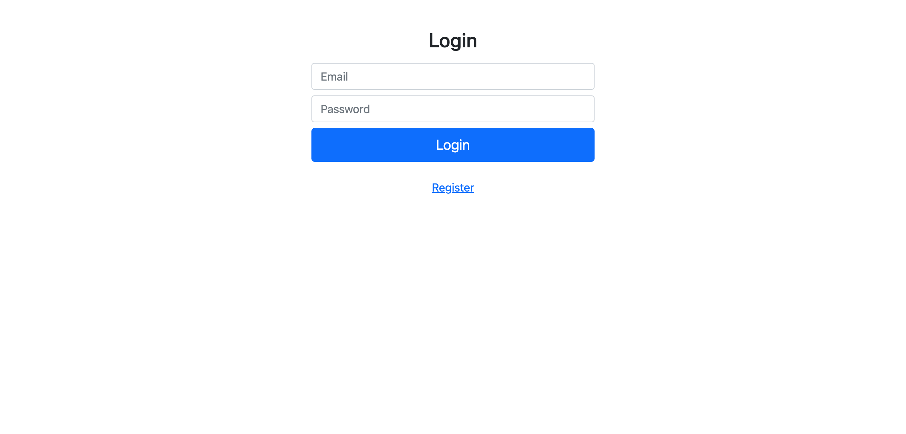

# PHP Form

-In this project, you will learn how to use  **session** and check a user is *valid* or not. And also know how to use **Super global vairable** like *$_GET* and so far.

-Currently, this project is still in ***progress***.